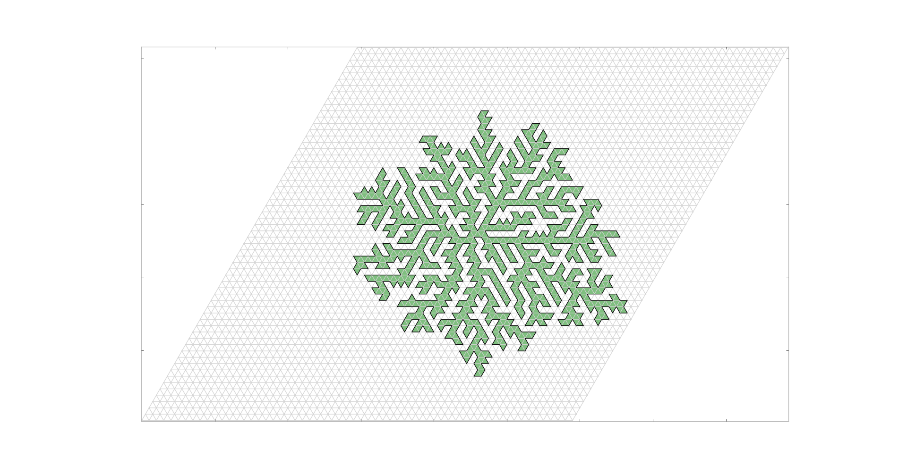

How to detect inside of the string
==================================

(日本語)

growing_string.pyの振る舞いを変更することにより，
初期条件を閉曲線のひもから始めると，閉曲線の構造を保ったまま成長することができるようになった。

ここで，閉曲線の内側だけを塗りつぶしてみると，枝分かれ構造になっているように見える。

そこで，ある任意のループ初期条件でのクラスターが与えられた時，そのクラスターの内側の部分をどのように認識することができるか，という問題を考える必要がある。

この機能は，コンピューター・グラフィックスの世界では閉領域の塗りつぶしに対応し，
よく知られている1つのアルゴリズムとして，画像をピクセル単位で見た時，
ある行の中で，境界として扱われる点が複数存在しているだろう。
これら境界が1つの画像の中で閉であるなら，この走査線と境界の交点は必ず偶数個存在することになる。

したがって，内側の領域を塗りつぶしたい際には，奇数番目の境界との交点と，偶数番目の境界との交点の間の領域をすべて対象の値に置き換えれば良いことになる。


以上のアルゴリズムの概要を踏まえた上で，今回のひも状オブジェクトの内部を識別するという問題を考えた際に，
まず，境界線が存在するかどうかの情報を保持するために，元の格子の大きさを$L_{x} \times L_{y}$とすると，新たに$2L_{x} \times L_{y}$の行列を作成する必要がある。
(ここで$x$方向の要素数が2倍になっているのは，三角格子では下辺がx軸に平行な正三角形と
，上辺がx軸に平行な正三角形の二つによって作られた平行四辺形が，正方格子における単位升であり，
その中に正三角形は二つ存在していることから分かるように，三角格子における単位升の個数は，正方格子の場合の2倍となる。)

境界線をどのように検出するか?
------------------------------

上の議論で述べたように，まず初めにやるべきことは，境界線の検出を行うことである。
格子上のひもオブジェクトに関して保持されている情報だけで，これは実現することができる。
即ち，以下のようにひもオブジェクト$s$が存在していた時に，


1. 各点が$s$の位置座標として登録されているか?
2. 登録されていた場合，その点から伸びるベクトルの向きはどちらか?

を知ることにより，どのボンドに線が存在しているかを調べることができる。

例えば，図の(1, 0)点はひもオブジェクト$s$に占有されている。
そこでその点におけるベクトルを参照すると，これは2であった。
したがって，境界線を左辺にもつ三角形の座標(1, 0)が記録される。

同じ様に，点(3. 0)を見ると，そこでは1方向のベクトルを持っている。
したがって，左辺に境界線をもつ三角形の座標は(6, 0)となる。

これらをまとめると，以下のような条件式で表すことができる。

```python
check_index = [(i, j)
               for i in range(Lx)
               for j in range(Ly)
               if [i, j] in s.pos.tolist()]

for i, j in check_index:
    k = s.pos.index([i, j])
    vec = s.vec[k]
    if vec in [0, 3]:
        continue

    if vec == 1:
        x = 2 * i
        y = j
    elif vec == 2:
        x = 2 * i - 1
        y = j
    elif vec == 4:
        x = 2 * i
        y = j - 1
    elif vec == 5:
        x = 2 * i + 1
        y =  j - 1

    doubled_lattice[x, y] = True
```

このようにして，境界線の位置の情報を記録した行列`doubled_lattice`を生成する。

次の節では，この行列の情報を用いて，内部の判定を行うアルゴリズムの説明をする。

境界線の情報から境界内部を識別するアルゴリズム
----------------------------------------------

先ほどの結果得られた`doubled_lattice`を考える。

これを各行ごとに走査して，それぞれの三角形要素が境界の内部に存在しているかどうかを判定していくことにする。

まずはじめに，一番下の行を列方向に見ていくと，最初に境界線が存在するのは(1, 0)である。
その後は境界の内部にあるとし，次に境界線に会うのは(6, 0)であるから，(5, 0)までは境界の中にあるということにある。
同じ様に走査を続けていくと，今度は(7, 0)で再び境界が現れるので，その次の境界(10, 0)までは境界の内部に存在することになる。

これを単純なアルゴリズムとして表すと，`True`,`False`の内部状態をもつ変数を1つ用意すると実現できる。
具体的には以下のように評価を行う(`arr`には`doubled_lattice`が代入される):

```python
def fill_inside(self, arr):
    """Fill inside

    arr: (m x n: boolean ndarray)
    """
    size_x, size_y = arr.shape
    ret_arr = np.zeros((size_x, size_y), dtype=np.bool)
    for j in range(size_y):
        flag = False
        for i in range(size_x):
            tf = arr[i, j]
            if flag ^ tf:
                ret_arr[i, j] = True

            if tf:
                flag = not flag
    return ret_arr
```

内部状態は変数`flag`に保持され，`doubled_lattice`の情報とあわせて，その排他的論理和を条件とすることで，対象の三角形領域が
境界の内部に存在するかどうかを判定することができる。
上の関数では，その結果は`ret_arr`として返されている。

実際に描画してみる
------------------

matplotlibのPolygonメソッドを用いて，得られた結果から実際に描画してみると，以下の図のようになる。



課題
----

$i=0$をまたぐような場合に，`flag`の設定が不自然な場合がある。
暫定的な解決策としては，$i=0$をまたぐことが無いように初期条件とステップ数を設定しておくことである。

将来的にこの問題を解決する方法としては，種の三角形から隣接する三角形を占有していく方法が考えられる。


